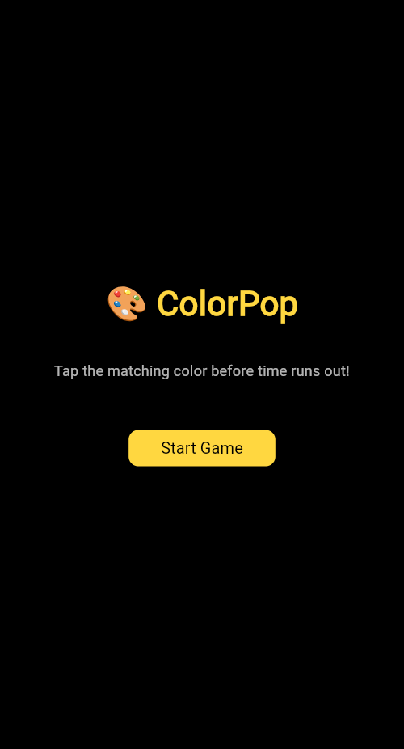
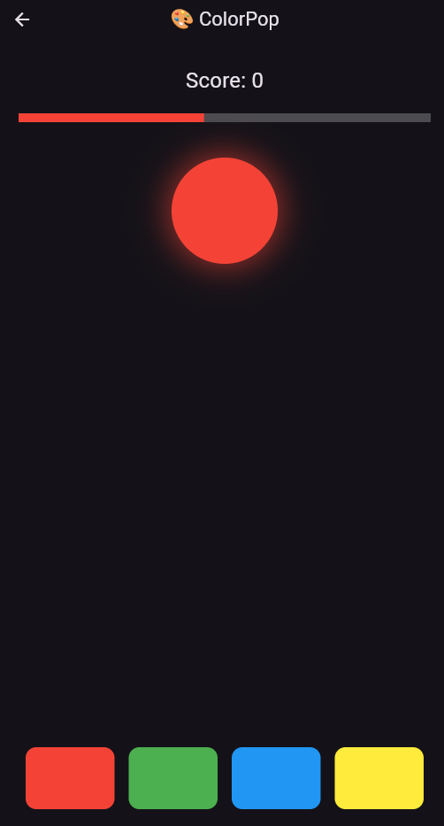

# 🎨 ColorPop

**ColorPop** is a fast-paced and visually striking Flutter game that challenges your reflexes and color recognition skills. A glowing color appears on screen — tap the matching color button before the timer runs out!

---

## 🕹️ Gameplay

- A glowing circle appears in a random color.
- Four vibrant color buttons are shown below.
- Tap the button that **matches the circle's color** before time runs out.
- The game gets faster as you score higher!
- Tap wrong or run out of time? Game over!

---

## ✨ Features

- 🎮 Easy one-tap gameplay
- 🌈 Colorful animations and transitions
- 🧠 Great for reflex training
- ⏱️ Timer-based challenge
- 🏠 Smooth home screen and restart flow
- 📱 Clean, minimal and responsive UI

---

## 📸 Preview

<p float="left">
  
  
</p>

---

## 🚀 Getting Started

To run **ColorPop** locally:

```bash
git clone https://github.com/your-username/colorpop.git
cd colorpop
flutter pub get
flutter run
```
---
## 📦 APK Release

You can download the latest APK from the [Releases](https://github.com/saif-pain/ColorPop/releases) section
